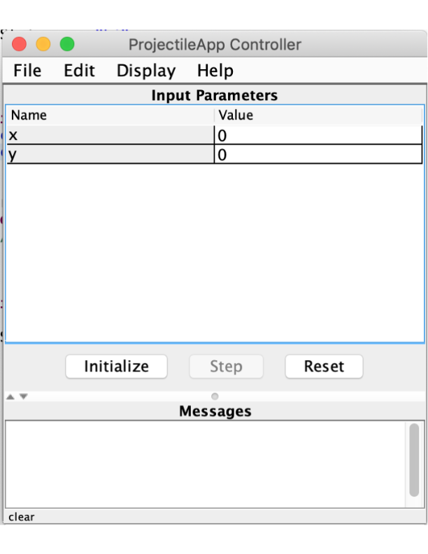
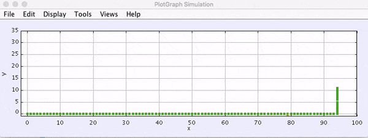

Projectile Assignment
=====================

Introduction to Simulations
---------------------------

.. figure:: test3.gif
  :width: 100%
  :align: center

This assignment will focus on projectile motion. You have already learned how
to track the movement of a massless particle using kinematics equations.
However, there are some limits to what you are able to calculate by hand.
Therefore, it can be useful to instead use a computer model to simulate the
movement of a particle.

There are certain assumptions that are made in the kinematics equations you
use in your physics classes. You treat the projectiles that you use in
problems as massless points. These assumptions allow you to solve problems
more easily and provide close approximations to the "correct" answer. You will
also need to make some assumptions in the simulations you build.

You should construct your simulation in layers of complexity, which means that
the first draft of your simulation should be as simple as possible. Then, you
can start to add on features and tweak your code to get closer and closer to a
more accurate model. Alternatively, trying to make your simulation too
complicated too quickly will likely give you issues when you try to debug.

Introduction to Modeling
------------------------

Modeling is a concept that has broad definitions and meanings, even in
science. We may never know the ‘true’ nature of the Universe and the laws
governing its evolution – however, as scientists, we have made giant strides
in discovering ever more precise approximations of its nature. These models
enable us to understand how its different elements and systems interact. We
can sometimes make predictions of future events or understand why that is
impossible. Newton’s Laws of Motion, General Relativity, Quantum Mechanics,
and String Theory are but a few of the fundamental models of different realms
of the universe around us.

Another way that science uses the idea of a model is when working within one
of the models above. We simplify situations, hoping to include only the
dominant physics that will model most of what we observe. For example, when
understanding the orbit of the earth around the sun, we might start with these
simplifications:

- The earth is the only planet
- The earth doesn’t have a moon
- The sun is fixed in space

Using this model allows us to understand much, but not all, of the dynamics of
a solar system.

Since many models in Physics are described mathematically, the simplified
models scientists work with involve solving mathematical systems of varying
complexity. Sometimes these systems can be solved ‘by hand’ with the tools you
are currently acquiring. More often the systems are too complex and their
solutions must be found in another way. One way to do this is with a computer
simulation – another tool you are learning to employ.

Modeling Projectile Motion
--------------------------

You are standing on the Brooklyn Bridge holding a rock. If you throw the rock
and watch it fly through the air, what quantities can you determine?

- If you know the rock’s initial velocity, and can determine where it lands,
  what can you learn about the height of the bridge?
- If you already knew the height, could you predict where it would hit the
  water?

You will begin to model the answers to these questions by creating a computer
simulation of the rock’s motion.

.. admonition:: Pseudocode

   When creating an algorithm, it can be helpful to start by writing
   **pseudocode**: text which describes a program without having to
   follow exact Java syntax. For example, the pseudocode for a program
   which finds the largest number in an array could be:

   .. code-block:: text

      set LARGEST to the first element in the array

      for each element in the array:
        if CURRENT_ELEMENT is greater than LARGEST:
          then set LARGEST to CURRENT_ELEMENT
        otherwise do nothing

      output LARGEST

   As you write pseudocode, imagine that a human will be reading and running
   your program, rather then the computer.

Review: Displaying Simulations using OSP
-----------------------------------------

You will use the **Open Source Physics** (OSP) library to display your physics
simulations. You've already used OSP (specifically the ``PlotFrame`` class) to
plot graphs and Riemann sums, and you used ``AbstractSimulation`` to make an animation n ``Getting Started``. This section will review how to create OSP animated
simulations.

.. note::
    It might be useful to look at the `JavaDocs for OSP <https://kjergens.github.io/osp-5.1.0/out/html/index.html?overview-summary.html>`_ 
    in order to see for yourself what its methods look like. In the future, if
    you ever want to learn more aout a class, checking the documentation is a
    good place to start.

The Simulation Class
^^^^^^^^^^^^^^^^^^^^

The first step when making an OSP simulation is to create a class which
extends ``AbstractSimulation`` (`doc
<https://kjergens.github.io/osp-5.1.0/out/html/org/opensourcephysics/controls/AbstractSimulation.html>`__),
the abstract class from which all simulations inherit::

    public class Projectile1DApp extends AbstractSimulation {
        // ...
    }

You'll notice an error pop up; that's because ``AbstractSimulation`` has an
abstract method called ``doStep()`` which must be implemented inside of your
simulation class (the ``@Override`` annotation is a reminder that ``doStep()``
is implementing a method from its superclass).

``doStep()``
^^^^^^^^^^^^^^^

``doStep()`` is a function that is repeatedly called while the simulation is
running. You can think of it as a looping ``main()`` function, or as a
built-in while loop that always has a true condition. Since the code
in ``doStep()`` will be repeated thousands of times throughout the course of
the simulation, it is very important to think about how you will optimize your
code so that it is as computationally efficient as possible.

::

    @Override
    protected void doStep() {
        // ...
    }

.. note::
  You can make your simulation a little faster by avoiding updating your
  graphics every ``doStep()``. Instead of just telling the simulation app to
  run the ``doStep`` less often, which will just slow the simulation down, or
  increasing your time interval, which will make your calculations less
  accurate, you can put a ``for`` loop inside of your ``doStep()``. If you run
  calculations inside of the ``for`` loop and update your grpahics outside of
  the loop, you can determine for yourself how many times you want to allow
  the calculations to update before the graphics update.

``doStep()`` will be called repeatedly by OSP as your program runs; you will
update the particle's properties and display its new position inside of this
method.

Next, add the ``reset()`` and ``initialize()`` methods to ``Projectile1DApp``

``reset()``
^^^^^^^^^^^^

``reset()`` runs at the start every time you run your simulation app. (It really should be called "setup" because it is run first, even before ``initialize()``. This is a good place to add
all of the information to the **Control Panel** that you want the user to be
able to update with their own input. You can do this by writing
``control.addValue("variableName", variableValue)``. Additionally, if you stop
a simulation that is already initialized and running, you can press the
**Reset** button to restart it and reinitialize it. In order to use this
feature, during ``reset()`` it is best to clear off all of your graphics.

::

    @Override
    public void reset() {
        // ...
    }

``initialize()``
^^^^^^^^^^^^^^^^^

``initialize()`` runs directly after ``reset()`` and right before the first
``doStep()``. As the name of the function suggests, it is a good time to get
everything set up for your simulation. During this step, you should take all
of the input from the **Control Panel** and store it in variables in your
code. You can do this by running ``control.getDouble()``,
``control.getString()``, etc., using the appropriate function for your desired
data type.

::

    @Override
    public void initialize() {
        // ...
    }

As with ``doStep()``, you will never call these methods yourself. Rather, they
will be called by the superclass, ``AbstractSimulation``. Just as ``getSubintervalArea()``
and ``drawSlice()`` had specific implementations for each Riemann sum rule,
``doStep()``, ``reset()``, and ``initialize()`` have specific implementations
in your simulation. The ``reset()`` method will contain code which resets the
simulation's properties to their default values, while ``initialize()`` will
contain code to set up the simulation before it runs.

``main()``
^^^^^^^^^^
The last method you should add is a main method---the simulation class will
be the main class for your program. This method will tell OSP to set up
the simulation when the program starts::

    public static void main(String[] args) {
        SimulationControl.createApp(new FreeFallApp());
    }

Control Panel
^^^^^^^^^^^^^^^^

Your simulation app will automatically generate a pop-up window called a
**Control Panel**. The **Control Panel** makes incorporating a lot of user
input easy. Notice that there are three buttons on the **Control Panel**.
**Initialize** and **Reset** each correlate to the ``initialize()`` and
``reset()`` functions, respsectively. So, pressing the **Initialize** button
on the **Control Panel** will run ``initialize()``. The **Step** button will
run the code in your ``doStep()`` exactly once.

.. admonition:: Optional Exercise

  **Summary**: Create an ``AbstractSimulaton`` class.

  #. Open the window to create a new class in your package. Name the class [...]App. This is the naming convention for your simulation classes.
  #. Before you click **Finish**, click the **Browse** button next to the **Superclass** text box. Choose ``AbstractSimulation`` and click **OK**.
  #. Under the "method stubs" section, choose to click the box next to ``public
     static void main(String[] args)``.
  #. In ``main()``, add this line: ``SimulationControl.createApp(new <NAME OF CLASS>());``
  #. Declare the following functions:

   - ``public void initialize()``
   - ``public void reset()``
   - ``public void doStep()``

Assignment
----------

You will have to use the AbstractSimulation class for this project. Your
simulation class should **extend** AbstractSimulation. You will also need to
construct a **Particle** class. Try to be as thorough and thoughtful as
possible when you make this class, because you will likely use it in the rest
of your physics assignments.

When you make the **Particle** class, consider what variables might affect how
a projectile moves in air. These variables should be the **fields** in the
class.

.. note::
  While it can be tempting to code everything at once and then test it all at
  the end, the graphics are actually often helpful in order to give you a
  sense of what's working and what's not.

Base Assignment
------------------

There are two parts of the base assignment. Part 4 will take much longer than
Parts 1 - 3; it is essentially a mini-extension. While everyone in the class will do the same base
assignments, you will not necessarily all get exactly the same values. This
will depend on how you choose to calculate your position variables, your
timestep, and, for Green Monster (Part 4), the way that you run your
different iterations.

Since there is no "right" answer, it can be difficult to tell if you are on
the right path. You can try to compare answers with your fellow students to
see if your approximations are at least close to each other. You can also try
to calculate some of these scenarios by hand in order to see whether you get
an answer that's close. However, in the end, the goal is not really to get a
certain "right" answer (since everything we do is an approximation), but
rather to get an understanding of the physics concepts and their
implementation.

Before you start your base assignments, consider:

- What variables might affect the flight of your particle? These variables
  should be your attributes.
- What variables should the user be able to input?
- How will you represent your particle on the screen?

1a. Particle
^^^^^^^^^^^^^^^^^^^^^^^^^^^^^^^^^^^^
.. admonition:: Exercise

  **Summary:** Design and implement a Particle object.

  #. In src folder, create a new package namespace called ``com.[yourname].projectile``.
  #. In ``projectile`` create a new Java class called ``Particle``.
  #. Design the ``Particle`` class to model the motion of a particle - for example, a rock - in one dimension. Just like the real rock, you want your simulated rock to have certain properties at a given time. These properties correspond to the **fields** (attributes, aka, member variables) of the ``Particle`` object. What properties does a real particle have? What fields should an object of this type have?
  #. HINT: OSP already comes with a Circle object that keeps track of its x and y and also can be added to a PlotFrame as a Drawable. Can you extend Circle to be a Particle?
  #. Add a constructor to ``Particle`` which takes initial values for these properties and initializes the particle accordingly.
  #. Write a method ``step()`` which handles its motion after one segment of time. While in real life particles move continuously, you will model them as moving in discrete time steps. In each step, a certain amount of time :math:`\Delta t` should pass and the particle's attributes should be updated. The method should take at least one  parameter, :math:`\Delta t` deltaTime. Use motion equations you have learned in physics class to update the relevant properties of the particle after each time segment elapses. The question you should be asking yourself is **"if** :math:`\Delta t` **seconds pass, what are the new properties of the particle?"**

1b. Particle with air/water pressure
^^^^^^^^^^^^^^^^^^^^^^^^^^^^^^^^^^^^
.. note::
  **Useful formulas:**

  - weight = mass x gravity
  - drag = air pressure x drag constant x cross sectional area x velocity :math:`^2` / mass x 2
  - total net force = weight + drag
  - acceleration = total net force  /  mass

  **Useful values:**

  - drag constant: :math:`0.02`
  - air pressure at sea level and 15 degrees C: 1.225 :math:`kg/m^3` 
  - cross sectional area of a sphere: the area at the largest diameter (diameter at the center)

.. admonition:: Exercise

  **Summary:** Enhance your Particle object to consider air/water pressure.

  #. In your existing ``Particle`` object add attributes for ``mass`` and ``radius``. Update the constructor accordingly. 
  #. Write a second ``step()`` method. 
  #. The second step method should also take :math:`\Delta t` deltaTime as a parameter but also take ``pressure``. Pressure is the air or water pressure the particle is travelling through. This is a constant that can be looked up. 
  #. As a first step to finding the effect of pressure, compute the ``weight`` of the particle using its ``mass`` and the force of gravity.
  #. Compute the ``drag``. Drag is the force that is opposite the direction of travel and works against its weight. It is computed with a combination of ``pressure``, ``mass``, the cross-sectional surface area and a ``drag constant``. See complete formula above.
  #. Once you know the force of ``drag``, add it to the ``weight`` to get the ``total net force``.
  #. Set the acceleration of the particle to the ``total net force`` divided by the ``mass``.
  #. Set the other attributes of the particle like you did in the first ``step()`` method.
  #. Once the particle has reached **terminal velocity**, its acceleration should not change. (In other words, drag should never make the particle float upwards.) It is for you to figure out the **terminal velocity**.

.. warning::
  Make sure that your air resistance is affecting the particle in the right
  way (i.e., check the direction of the air resistance as the particle moves.
  Which way should the air resistance vector be pointing in relation to the
  particle's velocity?)

2. FallingBallApp
^^^^^^^^^^^^^^^^^^^^^^
.. admonition:: Exercise

  **Summary:** Simulate a particle moving in one dimension.

  #. In ``projectile`` create a new Java class called ``FallingBallApp`` that extends from ``AbstractSimulation``. Add all the necessary methods.
  #. Create a ``PlotFrame`` to hold the simulation. 
  #. Add two ``Particle`` objects to the PlotFrame. Each ``Particle``. One ``Particle`` will move without air pressure, and the other will move with air pressure.
  #. Create three more ``PlotFrame`` s and plot each of these data per ``Particle`` object:

  - Position over Time
  - Velocity over Time
  - Acceleration over Time

  When you have these four plots you are done with this exercise.

   .. figure:: falling_ball.gif
    :width: 90 %
    :align: center

    The red particle has no air pressure and the green one has air pressure. Results will depend on the air/water pressure you chose and the mass and radius of the particles. 

3. ProjectileApp (2D movement)
^^^^^^^^^^^^^^^^^^^^^^^^^^^^^^^^

.. admonition:: Exercise

  **Summary:** Simulate a projectile.

  #. In ``projectile`` create a new Java class called ``ProjectileApp`` that extends ``AbstractSimulation``.
  #. Edit your ``Particle`` object so it moves in two dimensions. 
  #. In ``ProjectileApp``, create a ``PlotFrame`` and plot two ``Particles`` , both moving in two dimensions, one without air resistance and one with. Look up the golden rule in order to add this second dimension.

  When you have something that works like the following you are done with this exercise:

  .. figure:: projectile2D.gif
    :width: 100%
    :align: center

    The red particle has no air resistance and the green ball has air resistance. Results will vary depending on the air pressure and size of your particles.

4. BaseballSimulationApp
^^^^^^^^^^^^^^^^^^^^^^^^^
.. admonition:: Exercise

  **Summary:** Apply what you've learned to a real example.

  The Green Monster is a wall in Fenway park. It is 10 meters tall and 100 meters away from home plate. Your assignment is to create an animation that simulates hitting a particle the size of a baseball from 1 meter off of the ground to show at what velocities it will or will not go over over the wall.

  #. Create a new Java class in ``projectile`` called ``BaseballSimulationApp`` that extends ``AbstractSimuation``.
  #. Create a ``PlotFrame`` that will hold the animation.
  #. On the ``PlotFrame``, draw a rectangle or line to represent the Green Monster.
  #. Also on the ``PlotFrame``, show a ``Particle`` moving in both x and y directions, 1 meter off the ground, moving toward the wall.
  #. Use the Control Panel to change the velocity and discover the angle at the minimum velocity to clear the wall.

  .. figure:: greenmonster.jpg
   :width: 100 %
   :align: center

  Example of a failed attempt to hit a home run.

Extension
-----------

When you are done with the base assignment, extend it to model another real-world object. 

.. admonition:: Exercise

  **Summary:** Model a real-world object of your choosing that moves in two dimensions.

  Physics extensions are very open ended, and the above prompt is not very exact. You should work through your idea for your extension with a physics teacher in order to determine together what might be a realistic goal based on your initial idea. While you work on the base assignment, you should think about what you might be interested in modeling.

  The most important component of this extension is your understanding of the
  underlying physics concepts. While looking up equations online might give you a realistic simulation, you will not learn anything if you don't understanding why the formulas that you use will give you good approximations.

  Once you know what you want your extension to be, just as you did in ``Riemann``, you will build off of the code you already wrote for your base assignment. You will present the extension to the class and the teachers, so be ready to talk about what you learned and to answer some questions.

.. TODO: Add something about past extensions?
